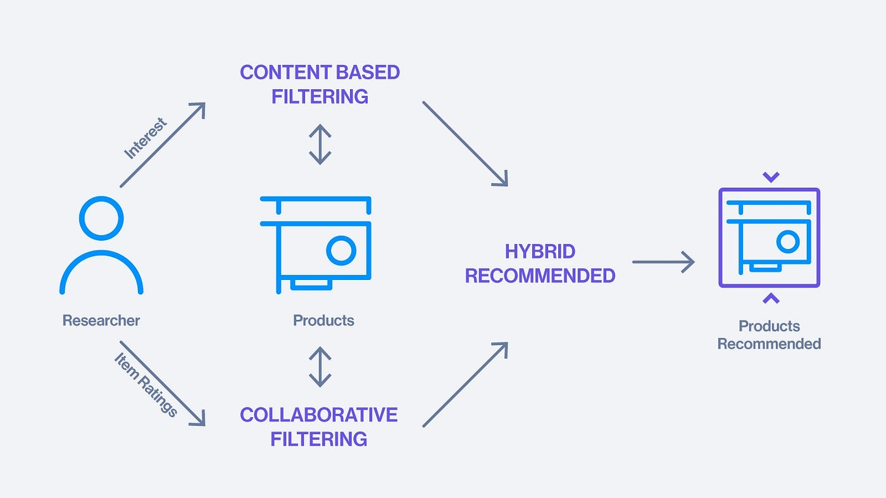

# Evaluating Recommender Systems for Digital Library Datasets
## Introduction
This project is part of my Bachelor's thesis and focuses on developing an AI-based recommendation system. The system aims to provide personalized recommendations to users based on their preferences and behavior.

## Assignment Description
Being always timely and correctly informed greatly helps in our decision-making. Finding sufficient information to solve tasks and problems we encounter and quickly and safely orienting ourselves in them is a necessity in everyday life as well as in studies. A system that could recommend relevant information related to our study subject during searches would significantly aid in acquiring new useful knowledge for us.

Map the currently used web recommendation systems and algorithms. Also, explore the possibilities of similar AI-based tools. Analyze the possibilities of their use for recommendation systems in the context of digital libraries and repositories. Propose and implement your own solution utilizing recommendation systems to simplify information retrieval. Evaluate the implemented solution on real data from a freely available repository.

## Key points
- Ratings density
- Recommender systems
- Concept drift
- Temporal dynamics
- Dimensionality reduction
- Recommendation algorithms
- Case-based reasoning
- Search engines
- Semantics
- Knowledge based systems

